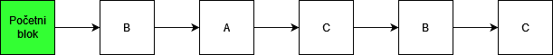
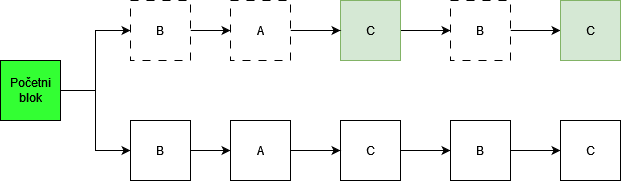
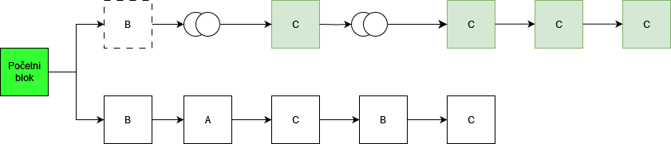

## Long-range napadi
Kao što je rečeno u [PoS vulnerabilities](/osnovni-pojmovi/pos-napadi.md), long-range su napadi u kojima napadač(i) pokušava da napravi alternativnu istoriju blockchain-a počevši od početnog bloka. Dele se na 3 vrste: jednostavni, posterior corruption i stake bleeding.
### Jednostavni long-range napad
Zbog lakšeg razumevanja posmatraćemo sistem sa 3 validatora(biće obeleženi kao A,B i C), gde svaki od validatora poseduje 33,3% sistema. Da bi ovakav napad bio uspešan PoS sistem mora biti prost, tj. sistem bez ikakve provere vremenskih oznaka(timestamps). Svaki od validatora ima istu šansu za validaranje blokova. Na slici ispod nalazi se primer dodavanja blokova u blockchain gde na svakom od blokova piše ko ga je validirao. 

Kada čvor C pokrene long-range napad, on pravi kopiju blockchain-a počevši od početnog bloka i počinje da pravi granu koja će sadržati drugačije transakcije. Na slici ispod nalazi se primer kreiranja nove grane od strane čvora C. Gornja grana predstavlja granu koju je čvor C kreirao i ona je sačuvana lokalno, dok je donja grana aktivna i glavna grana u sistemu.

Pošto se informacije o validatorima čuvaju u početnom bloku, čvor C ne može da pravi nove blokove brže nego što bi ih pravio u glavnoj grani. Zbog ovakvih ograničenja čvor C mora da pravi blokove unapred i lažira vremenske oznake za njih, time čvor C pokušava da pretekne glavnu granu. 

Na slici iznad sa dva kružića obeleženi su izostavljeni blokovi. Na slici obe grane imaju istu dužinu.
Pošto je čvor C jedini aktivni učesnik u grani koju je kreirao, on njome može manipulisati kako želi. Kao rezultat ovoga(u implementacijama koje ne proveravaju vremenske oznake) obe grane će biti validne, a ostali čvorovi neće moći da primete da je grana koju je čvor C kreirao falsifikat i tako ta grana može postati glavna, a čvor C može preuzeti ceo blockchain.

