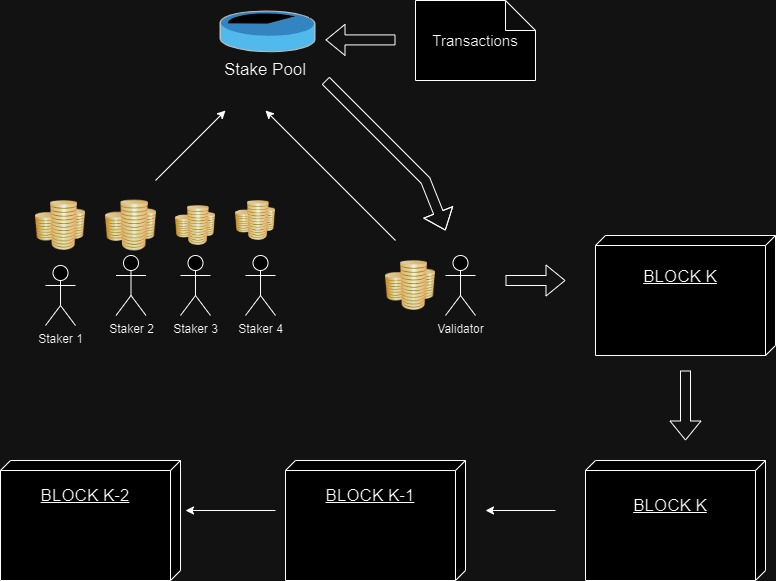

# Proof of Stake

Proof of Stake je koncenzus algoritam u blockchain mrezama za validaciju i autentikaciju transakcija i kopanje novih blokova.
Osnovne akcije u ovom algoritmu su

- Staking
  - Aktori, odnosto Stake-ri (i validatori) su u obavezi da ubace odredjena sredstva u Stake pool kao kolateral za ucestvovanje
- Block Creaton
  - Validatori su izabrani kako bi validirali transakcije i kreirali novi blok u mrezi
- Transaction Validation
  - Transakcije u mrezi se moraju validirati, i nakon sto su validirane, mogu biti upisane u blok
- Reward
  - Kada je blok uspesno iskopan, nagrade od naknada transakcija se dele medju ucesnicima Stake Pool-a, u zavisnost od njihovih zalozenih sredstava
     

### Napadi u PoS sistemu

- Long-Range attacks

  - U Long-Range napadu, napadac sa dovoljnim resursima, u teoriji moze da napise ceo niz blokova tako sto ce kreirati alternativan lanac of ranijeg checkpoint-a.
    Ovo vazi za PoS sisteme jer cesto dozvoljavaju da validatori potpisu blok retroaktivno

- Stake Grinding

  - Ovaj napad ukljucuje da validator manipulise sistemom kako bi povecao sansu da bude izabran za sledeceg kreatora bloka.

- Nothing to Lose

  - Desava se kada validator ne moze da izgubi zalog ukoliko se ponasa maliciozno. U nekim PoS sistemima, maliciozni validator nema prevelike penale za ovakve ispade

- Sybil

  - U ovom napadu, napadac kreira vise node-ova kako bi za sebe pridobio vecu moc i narusio decentralizaciju sistema.

- Censorship Risk

  - U PoS sistemu, validatori validiraju transakcije. Ukoliko su vecina validatora kontrolisana od strane istog entiteta, postoji sansa kompromitovanja mreze

- Rich-Get-Richer
  - PoS cesto nagrade za iskopan blok dodeljuje na osnovu zalozenih sredstava. Ovo moze kompromitovati mrezu tako sto ce se najveci zalagaci najvise i bogatiti od dobijenih nagrada, samim tim akumulirati moc i uticaj nad mrezom
