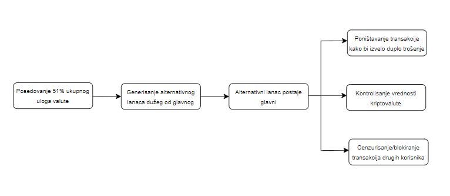
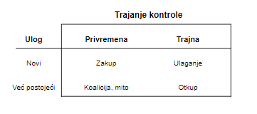

## 51% napad [[15]](https://sci-hub.se/https://ieeexplore.ieee.org/abstract/document/9068181)
Napadi od 51% predstavljaju pretnju za sve protokole konsenzusa. U PoW sistemima, entitet koji kontroliše većinu hash snage u određenom vremenskom okviru može imati potpunu kontrolu nad blockchain-om. To je moguće zato što je hash, odnosno računarska snaga ključna za dodavanje novih blokova u lanac kod PoW sistema. Entitet, koji može biti pojedinac ili grupa rudara, kada stekne kontolu nad većinom hash snage može stvoriti alternativni lanac koji je odvojen od glavnog lanca (fork). Zatim nastavlja da dodaje nove blokove na svoj alternativni lanac sve dok on ne postane duži od glavnog. Tada ga mreža može početi smatrati novim glavnim lancem, jer blockchain mreže obično prate pravilo da je najduži lanac pravi lanac.   
Što se tiče PoS sistema, da bi se izveo napad od 51% napadač mora da postigne 51% određene kriptovalute. Trošak postizanja 51% ukupnog uloga može biti ogroman, pa je i nivo pretnji od 51% napada niži u odnosu na PoW sisteme ali nije nemoguć.  
 
Slika 1. Stablo napada   
Strategija napada od 51% varira u zavisnosti od usvojenog mehanizma konsenzusa od strane određene kriptovalute, i pruža mogućnost napadačima da dvostruko potroše istu valutu, ograniče transakcije, otkažu blokove, ili ostvare kontolu nad cenom kriptovalute. Sa povećanjem računarske snage mreže, napad postaje skuplji što znači da su kriptovalute sa visokom hash stopom otpornije na ovaj napad.  
Dvostruko trošenje je jedan od problema koje tehnologije blockchain-a pokušavaju da reše od svog nastanka. Većina drugih napada imaju za cilj izvršavanje dvostruke potrošnje u nekom trenutku svog izvođenja. Napadač pokušava da potroši istu valutu bar dva puta, odnosno napadač prvo troši svoju valutu na validnom lancu. Zatim gradi alternativni lanac na kom valuta nije potrošena, i kada lanac postane dovoljno dug, napadač novi lanac predstavlja mreži. Kako je alternativni lanac duži od glavnog, on postaje glavni odbacujući blokove u kom je napadač potrošio svoju valutu.   
Postoji nekoliko načina na koje napadač može da preuzme kontrolu nad više od 50% ukupnog uloga [[17]](https://sci-hub.se/10.1002/cpe.6585). Na slici 2 je prikazano 5 načina za preuzimanje kontrole u zavisnosti od toga da li se kontrola dobija sa novim ili već postojećim ulogom. Kontrola može biti privremena ili trajna.   
 
Slika 2. Preuzimanje kontrole
- Najjednostavniji način za preuzimanje trajne kontrole je ulaganje dovoljne količine kriptovalute. Mana ovog metoda je što ukoliko napadač nema još uvek ulog potrebno mu je 51% ukupne količine uloga. Napadač mora da otkupi veliki broj valute, što će dovesti do naglog skoka cene. Da bi to izbegao napadač može da koristi blok trgovinu, odnosno da trguje velikim brojem kriptovaluta po određenoj ceni.  
- Sledeći primer je korištenje pametnog ugovora, tj ako osoba stvori ulog pomoću pametnog ugovora, vlasništvo nad pamtnim ugovorom se može preneti transakcijom. Na ovaj način, napadač može da otkupi postojeći ulog. 
- Za privremenu kontrolu, napadač može da pozajmi kriptovalutu da bi napravio novi ulog, a zatim da ga vrati. Ali kako je napomenuto, stvaranje novog uloga može biti skupo. Osim toga, privremeni ulog je ograničen jer ulog vezuje kriptovalutu za određeni period. 
- Za privremenu kontrolu, koalicija ili mito mogu biti upravljivi način za napadača. Korišćenje postojećeg uloga u PoS kriptovaluti neće naglo povećati cenu valute.  

Kako bi se zaštitili od 51% napada, razvijene su različite metode zaštite, međutim nemoguća je potpuna zaštita jer su slabosti ugrađene u sam protokol konsenzusa na kojem se zasniva blockchain tehnologija. 
### Mitigacije
Pet najnaprednijih tehnika koje se zasnivaju na ublažavanju napada od 51% su:
- Sistem kazni za odloženo podnošenje blokova – ova mera predlaže značajno povećanje troškova za napadača kako bi se smanjila mogućnost iskorištavanja mreže. Kazna se određuje na osnovu vremena koje je blok bio skriven od mreže. Vreme se izračunava na osnovu trajanja intervala između blokova. Ako napadač stvori alternativi lanac blokova, mreža će biti obaveštena i sve transakcije će biti zaustavljene dok se kašnjenje ne ukine. 
- Odloženi dokaz o radu (dPoW - Delayed proof of work) – je sigurnosni mehanizam koji je razvio Komodo. Dodaje sigurnosni sloj da bi sprečio napadače da izvrše napad od 51%. Raspoređuje 64 specijalna čvora širom sveta koji proveravaju da li je hash siguran za mrežu, a oni se biraju svake godine za željeni zadatak.
- PirlGuard – je sigurnosni protokol koji funkcioniše tako da kada napadač krene da se uparuje sa mrežom kako bi potvrdio svoje privatno izgrađene blokove, PirlGuard odmah prekida vazu sa tim učesnikom, primenjujući kaznu koja ga tera da iskopa određen broj blokova. Broj blokova koji su podložni kazni se određuje na osnovu broja blokova koje je napadač uspeo tajno da iskopa.
- ChainLocks – je sigurnosna tehnika gde je potrebno da većina učesnika (60% ili više) verifikuje određeni blok i generiše poruku kako bi se obavestio ostatak mreže. Poruka sadrži validan potpis koji potvrđuje autentičnost bloka. Jednom potvrđen blok ne može biti poništen.
- Spajanje rudarenja – nije sigurnosna tehnika ali je metoda koja može pomoći da se ublaži napad od 51%. Omogućava da se više kriptovaluta rudari istovremeno. Korist od spajanja imaju valute sa niskom moći heširanja koje čine isti konsenzus. Mogu povećati moć heširanja oslanjajući se na drugu valutu. 