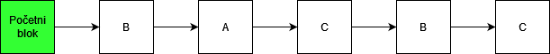
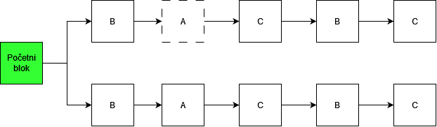
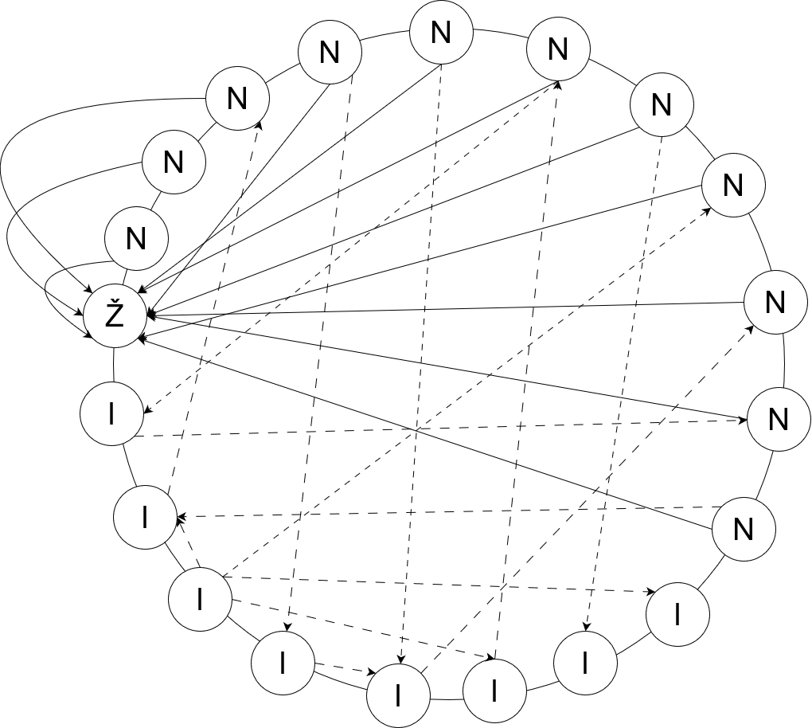
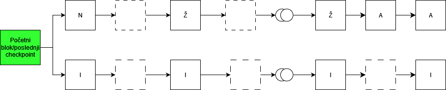
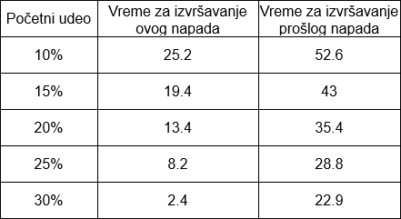

## Long-range napadi

Kao što je rečeno u [PoS napadi](/osnovni-pojmovi/pos-napadi.md), long-range su napadi u kojima napadač(i) pokušava da napravi alternativnu istoriju blockchain-a počevši od početnog bloka. Dele se na 3 vrste: jednostavni, posterior corruption i stake bleeding [[7]](https://sci-hub.se/10.1109/access.2019.2901858).

Pre svega, da bi ovi napadi bili uspešni PoS sistemi moraju podržavati reogranizaciju blockchain-a. Pravilo najdužeg lanca(grane) je pravilo gde je grana sa najviše blokova glavna grana.

### Jednostavni long-range napad

Zbog lakšeg razumevanja posmatraćemo sistem sa 3 validatora(biće obeleženi kao A,B i C), gde svaki od validatora poseduje 33,3% sistema. Da bi ovakav napad bio uspešan PoS sistem mora biti prost, tj. sistem bez ikakve provere vremenskih oznaka(timestamps). Svaki od validatora ima istu šansu za validaranje blokova. Na slici ispod nalazi se primer dodavanja blokova u blockchain gde na svakom od blokova piše ko ga je validirao. 

Kada čvor C pokrene long-range napad, on pravi kopiju blockchain-a počevši od početnog bloka i počinje da pravi granu koja će sadržati drugačije transakcije. Na slici ispod nalazi se primer kreiranja nove grane od strane čvora C. Gornja grana predstavlja granu koju je čvor C kreirao i ona je sačuvana lokalno, dok je donja grana aktivna i glavna grana u sistemu. 

Pošto se informacije o validatorima čuvaju u početnom bloku, čvor C ne može da pravi nove blokove brže nego što bi ih pravio u glavnoj grani. Zbog ovakvih ograničenja čvor C mora da pravi blokove unapred i lažira vremenske oznake za njih, time čvor C pokušava da pretekne glavnu granu.  

Na slici iznad sa dva kružića obeleženi su izostavljeni blokovi. Na slici obe grane imaju istu dužinu. 
Pošto je čvor C jedini aktivni učesnik u grani koju je kreirao, on njome može manipulisati kako želi. Kao rezultat ovoga(u implementacijama koje ne proveravaju vremenske oznake) obe grane će biti validne, a ostali čvorovi neće moći da primete da je grana koju je čvor C kreirao falsifikat i tako ta grana može postati glavna, a čvor C može preuzeti ceo blockchain. 

### Posterior Corruption

Opet ćemo posmatrati isti sistem kao u prošlom slučaju, uz razliku da čvor C nema mogućnost lažiranja vremenskih oznaka. Da bi promenio istoriju glavnog lanca(grane), mora generisati više blokova nego što ih ima u glavnoj grani, ali je čvor C ograničen činjenicom da ima fiksnu šansu za proizvodnju blokova.
Da bi povećao svoju u takmičenju sa glavnim lancem, čvor C mora falsifikovati blokove nekog drugog validatora. U ovom slučaju ako se neki od čvorova složi da napadne sistem zajedno sa čvorom C, napad postaje poprilično jednostavan, jer bi 2 čvora imala više od 50% ukupnog  uloga, međutim ovo nije nužno slučaj.
Da bismo razjasnili napad, moramo uvesti koncept rotacije validacionih čvorova. Zbog same prirode blockchain-a, mi nemamo nijednu statičku komponentu u sistemu osim početnog bloka. Validatori nisu izuzetak od ovog pravila, te validatore ne možemo smatrati statičkim, već se validatori moraju rotirati kako bi sistem bio pravičan. Osim toga, validatori imaju opciju povlačenja, a sistem ima mogućnost da ih rotira ili izbaci iz istoga ako se ne ponašaju pravilno. Na kraju, kada posmatramo čvor koji je pouzdan, njegova pouzdanost ne garantuje da će on ostati takav i kada napusti sistem. 
Recimo da čvor B odluli da se povuče iz sistema nakon što validira n blokova u glavnom lancu. Bob povlači svoj ulog, i od tada on nije više deo blokchain-a, ali njegovi blokovi jesu. Dok je čvor B bio validator, mogao je da koristi najbolje moguće mere za zaštitu i čuvanje njegovog ključa, međutim kada čvor B više nema ulog u sistemu, sigurnost njegovog privatnog ključa za validaciju blokova više nije prioritet za njega. 
Važno je napomenuti da iako čvor B ne može potpisivati blokove jer više nije validator, on(ili bilo ko drugi sa njegovim ključevima) može potpisati prvih n blokova bilo koje grane tog blockchain-a. Praktično ovo znači da neko ko ima pristup ključevima čvora B može falsifikovati blokove koje je čvor B validirao. Pošto čvor B više nije deo sistema, nema nikakav ulog i nema nikakvu odvraćajuću meru da ne izvrši napad protiv blokchain-a. U praksi, napad čvora B bio bi da on potpše prvih n blokova na drugom lancu blockchain-a sa napadačem ili za njega. 
Na osnovu prethodno navednog, postoje 2 moguća scenarija za napad (napad se naziva Posterior Corruption). Ili čvor C "hakuje" čvor B i krade njegov privatni ključ, ili čvor C podmiti čvor B i on se pridružuje napadu. U oba slučaja, ključ čvora B poznat je poznat čvoru C, te čvor C može potpisivati validne blokove pretvarajući se da je čvor B, povećavajući svoje šanse da prestigne glavni lanac. 

Na slici iznad prikazan je blockchain sa dve grane gde je donja grana glavni lanac, dok je gornja grana ona koja pripada čvoru C(ona se takmiči sa glavnim lancem kako bi ga prestigla). Na slici iznad, čvor B se pridružuje čvoru C u napadu. Sada je alternativna(gornja) grana mnogo konkurentnija, a šanse za prestizanje glavnog lanca su povećane. 
Pošto čvor B učestvuje u napadu(direktno ili indirektno), on će proizvoditi nove blokove u grani čvora C svaki put kada je izabran kao validator bloka. Za razliku od prošlog napada, blokovi čvora B u alternativnoj grani više nisu prazni i zlonamerna grana ima veće šanse u takmičenju sa glavnim lancem. 

### Mitigacije za prosti long-range napad i posterior corruption napad

Da bi se sprečio prosti long-range napad dovoljno je uvesti timestamp-ove i raditi njihovu kontrolu. 

Kao što je ranije rečeno, u posterior corruption napadima, validacioni čvorovi koji su napustili sistem, bez obzira na to što se njihovi ključevi ne koriste ili nisu važeći, mogu se koristiti za potpisivanje starijih blokova u blockchain-u. Da bi se ovo sprečilo koristi se key-evolving kriptografija(preciznije key-evolving potpis tj. KES). Koncept KES-a je da se životni vek ključa deli na epohe, pri čemu se za svaku epohu koristi drugačiji privatni ključ, dok javni ključ ostaje isti. Da bi se to dogodilo, postoji algoritam koji pravi novi privatni ključ od starog privatnog ključa, tako da epoha u kojoj je ključ napravljen postaje sastavni deo ključa. Čak i ako ključ procuri(neki čvor bude hakovan ili podmićen), taj ključ se ne može koristiti za potpisivanje starih blokova. Upotreba KES-a dovodi do nemogućnosti povratka na stariju verziju ključa i time sprečava sve vrste posterior corruption napada. 

Još jedna od tehnika za sprečavanje ovakvih napada je moving checkpoint. Moving checkpoint predstavljaju bezbednosnu tehniku koja se koristi u većini PoS sistema. Ideja moving checkpoint-a je da postoji maksimalni broj blokova u lancu koji mogu biti reorganizovani(odnosno poslednjih n blokova u grani). U zavisnoti od konkretne implementacije protokola taj broj je različit(može biti količina blokova koji se proizvedu u jednom mesecu,nekoliko dana ili sati). Korišćenjem ove tehnike long-range napadi se degradiraju u short-range napade, jer reorganizacija ne počinje od početnog bloka u blockchain-u, uz to glavni lanac postaje nepromenljiv do poslednjih n blokova.  

## Stake bleeding napad [[9]](https://sci-hub.se/10.1109/cvcbt.2018.00015)

Stake bleeding napad je efikasna strategija za izvođenje long-range napada koji se ne oslanja posterior corruption napad, samim tim nije ga moguće sprečiti pomoću KES-a(Key evolving signature - opisano gore). 

Ideja napada je sledeća: napadač(i) pokreće long-range napad koji istovremeno uključuje sve transakcije koje u obavljene u verodostojnom blockchain-u. S obzirom da će naknade od transakcija biti korištene kao naknada onima koji proizvode blokove na neki način, veliki broj naknada od transakcija u alternativnoj grani(lancu) biće skupljen od strane napadača(naknade koje potiču od čvorova koji ne postoje u alternativnoj grani biće ignorisane). Pretpostavljajući da je sistem radio neko vreme, moguće je zamisliti da če akumulirane naknade za transakcije pretvoriti napadača, koji poseduje manjinski udeo, u većinskog vlasnika i time će alternativna grana moći da napreduje brže od glavne grane. Zbog costless simulacije long-range napada, bilo bi moguće izvesti stake-bleeding napad iz proizvoljnog trenutka u prošlosti(pod pretpostavkom da sistem ne koristi checkpoint-e ili da checkpointi sežu u dalju prošlost), time bi napadač mogao da prepravi celu istoriju transakcija. 

Opis napada: napad se dešava u generičkom PoS sistemu koji je definisan nekim protokolom. Da bi bilo lakše za objašnjavanje pretpostavka je da napadač ima udeo koji je manji od 50%. Napadač simulira isti protokol koji koristi sistem i održava lokalnu kopiju trenutnog blockchaina(čuva je onako kako je propisano protokolom). Pored toga napadač ima i alternativni blockchain koji je trenutno prazan i sakriven od nenapadačkih čvorova. Napadač u svakom vremenskom slotu proverava da li mu je dozvoljeno da proširi glavni lanac ili lanac koji on čuva u skladu sa pravilima sistema. On preskače sve prilike za proširenje glavnog lanca, i time ne doprinosi njegovom rastu. S druge strane, svaki put kada se pruži prilika da se proširi njegov alternativni lanac, napadač ga proširuje novim blokom koji sadrži transakcije iz glavnog lanca koje nisu uključene u alternativnom lancu, a validne su u njegovom kontekstu. To mu omogućava da prima nagrade za stvaranje blokova i naknade za transakcije koje se nalaze u bloku. 
Kako vreme odmiče oba lanca će rasti, dok će glavni lanac rasti brže od alternativnog. Na glavnom lancu će napadačev udeo polako opadati(jer ne dodaje nove blokove na njega), dok će njegov udeo na alternativnom lancu polako rasti. Zbog toga će udeo napadača u alternativnom lancu u jednom trenutku premašiti udeo iskrenih čvorova u glavnom lancu. Od tog trenutka alternativni lanac raste brže u odnosu na glavni i u jednom trenutku postaje duži od njega. Ako sistem koristi pravilo najdužeg lanca, napadač objavljivanjem alternativne grane može narušiti glavni blockchain. Pre nego što objavi svoj alternativni lanac, napadač dodaje transakcije u kojima bi iskrenim čvorovima dao dovoljno uloga, te bi time smanjio sumnju. 
Da bi ovakav napad bio uspešan, uslovi su sledeći: sistem ne sme imati prečesto čuvanje čekpointa i mora pratiti pravilo najdužeg lanca(ako ima više lanaca, najduži postaje glavni), sistem ima naknade za transakcije, sistem mora omogućavati korišćenje transakcija u različitim kontekstima(napadač preuzima transakciju iz glavnog lanca i upisuje je i u svoj lanac), sistem mora smatrati da su lanci, na kojima upisuje manjinski deo vlasnika udela, validinim. 

### Mitigacije za stake bleeding napad

Jedna od mitigacija za ovakav napad opisana je i ranije u ovom dokumentu, a to je [moving checkpoint](#moving_checkpoint). 

Sledeća tehnika za sprečavanje ovakvog napada je provera gustine lanca u vremenskom domenu. Lanac koji napadač kreira, na početku, ima malu gustinu. U svim PoS protokolima je dozvoljeno da neki od učesnika nisu online sve vreme. Njihovo odsustvo sistem može detektovati posmatranjem blockchain-a, tj. postojaće određeni "slotovi" bez odgovarajućeg bloka. Ovo sistemu omogućava da detektuje i ukloni sve neodgovarajuće lance. 

Druga tehnika za sprečavanje ovog napada su transakcije osetljive na kontekst. Jedna od osnovnih karakteristika ovog napada je uzimanje transakcije "van konkteksta", tj. kopiranje transkacije iz glavnog lanca i dodavanje iste u privatni lanac. Veoma jednostavan i efikasan način da se ovo spreči je uključivanje konteksta, odnosno heša prethodnog bloka u svaku transakciju. To znači da validnost transakcije zahteva pristustvo tog heša u blockchain-u. Ovo bi dozvolilo samo zlonamerno generisanim transakcijama da budu prenosive na alternativni blockchain, i time bi napad bio potpuno neutralizovan (ne bi došlo do "krvarenja" uloga iskrenih čvorova u privatnom lancu). 

## Eclipse-based stake-bleeding napad [[11]](https://dl.acm.org/doi/abs/10.1145/3327960.3332391)
Pre nego što krenemo u opis ovog napada, potrebno je znati šta je eclipse napad. U eclipse napadu, napadač izdvaja određeni čvor(ili više njih) unutar mreže(umesto napada na ceo blockchain), te stvara veštačko okruženje oko tih čvorova kako bi sprečio da primaju transakcije ili druge informacije od ostalih (iskrenih/poštenih)čvorova [[12]](https://www.ledger.com/academy/glossary/eclipse-attack). 
Kao što je ranije rečeno, posterior corruption napada zahteva hakovanje ili podmićivanje ostalih čvorova da bi oni pisali u napadačevom privatnom(alternativnom) lancu. Ovaj napad koristi eclipse napad, inspirisan je posterior corruption napadom, ali key-evolving cryptography ne sprečava. Ovaj napad je podeljen u dve faze: fazu pripreme i fazu implementacije. 
Faza pripreme: U ovoj fazi napadač(i) biraju žrtve na glavnom lancu i izvode eclipse napad na njima. Cilj napadača je da izvede eclipse napad na neke iskrene čvorove koji drže relativno veliki ulog na glavnom lancu. Napadaču je lakše da "zatamni" manji broj žrtava tokom dužeg vremenskog perioda, istovremeno manji broj žrtava, koji drže relativno veliki udeo, će učiniti napad efikasnijim. Napad počinje od početnog bloka ili poslednjeg checkpoint-a, a napadač produžava privatni lanac nakon bloka koji sadrži informacije o svim validatorima. Važno je napomenuti da su i žrtve napada i napadač validatori.
Napadač prvo izvodi eclipse napad koji manipuliše tabelama koje čuvaju ID-jeve čvorova na čvorovima koji su žrtve. Većina blockchain sistema, poput Etherium-a, koristi [EDSCA](https://www.hypr.com/security-encyclopedia/elliptic-curve-digital-signature-algorithm) algoritam za generisanje javnog ključa svakog čvora, pa se čvorovi identifikuju svojim javnim ključevima(oni predstavljaju ID-jeve čvorova). Pošto je lako je lako generisati više ID-jeva čvorova korišćenjem [EDSCA](https://www.hypr.com/security-encyclopedia/elliptic-curve-digital-signature-algorithm) algoritma u nekoliko sekundi, napadač može kreirati veliki broj ID-jeva čvorova koristeći samo nekoliko IP adresa. Pošto se tabele sa čvorovima na čvorovima žrtava prazne svaki put kada se čvorovi restartuju, napadač može ubaciti veliki broj lažnih ID-jeva u tabelu čvora žrtve. Posle toga se čvorovi žrtve povezuju sa čvorovima čiji su ID-jevi smešteni u njihovim tabelama čvorova. Pošto su ID-jevi čvorova povezanih sa žrtvama u vlasništvu napadača, sve odlazeće i dolazeće konekcije biće povezane sa napadačem.  

Na slici iznad slovom Ž obeležen je čvor žrtve, slovom N čvorovi koje je kreirao napadač, a slovom I iskreni čvorovi u mreži. Svi iskreni čvorovi ne znaju za postojanje čvora žrtve, a čvor žrtve ne zna da postojanje iskrenih čvorova. Nakon eclipse napada na žrtve, čvorovi žrtava su odvojeni, oni mogu videti samo privatne lance napadača i samo na njima mogu kreirati blokove.
 
Faza implementacije: Nakon što su žrtve u "zamračenom" stanju, napadač počinje sa izvođenjem stake-bleeding napada. 
Na početku verovatnoća da napadač i žrtve kreiraju novi blok na privatnom lancu je ista kao i na glavnom lancu. Svaki put kada je napadač izabran kao validator za sledeći blok, on preskače svoj red, te se u tom slotu ne dodaje novi blok na glavni lanac. Slično tome svaki put kad jedna od žrtava dobije šansu da kreira novi blok na glavnom lancu, ona preskače svoj red jer ne može videti glavni lanac. Tako da gustina glavnog lanca postaje ređa(rast glavnog lanca se smanjuje). Napadači će istovremeno emitovani neke od transakcija sa glavnog lanca žrtvama. Kada su žrtve ili napadač izabrani kao validator na privatnom lancu, oni pakuju transkacije u blokove na privatnom lancu i dobijaju odgovarajuće naknade za transakcije i nagrade za kreiranje blokova. Iako će neke transakcije između napadača i žrtava biti uključene u blokove na privatnom lancu, naknade za transakcije plaćaju sami, pa su beskorisne za rast udela na privatnom lancu. S druge strane, ako napadač i žrtve upakuju sve transakcije sa glavnog lanca u blokove na privatnom lancu, dobiće odgovarjuće naknade za transakcije(jer oni nisu uključeni u njih i pretpostavlja se da napadač neće slati transkacije iskrenim validatorima na glavnom lancu). Kako napad napreduje, pošto žrtve i napadač preskaču kreiranje blokova na glavnom lancu, njihov udeo na glavnom lancu će se smanjivati. Istovremeno će se udeo napadača i žrtve na glavnom lancu povećavati. U jednom trenutku će privatni lanac prestići glavni lanac po dužini. Kada se to dogodi, napdač šalje transakciju iskrenim validatorima koja sadrži većinu njihovog udela. Zatim napadači prekidaju eclipse napad i objavljuju svoj privatni lanac. Zbog veće dužine ovog lanca od glavnog, iskreni validatori će prihvatiti ovu granu kao glavnu. 

Na slici iznad prikazan je izgled glavne(donja) i alternativne(gornja) grane(lanca) posle nadapa, slovom Ž obeleženi su blokovi koje je validirao čvor žrtve, slovom N blokovi koje je validirao napadač, a slovom I blokovi koje su kreirali iskreni čvorovi. Kvadrati koju su nacrtani isprekidanim linijama predstavljaju prazni slotovi. 

Uslovi za ovakav napad: nema mehanizama za kreiranje checkpoint-a(ili checkpoint-i nisu dovoljno učestali), nema smanjivanja udela za neaktivnost u glavnom lancu, eclipse napad mora biti jeftin i dugoročno efektivan. 
 
Prošli napad(stake bleeding) je znatno sporiji od ovakvog napada(prvenstveno zbog smanjenih nagrada i naknada). U tabeli ispod nalazi se poređenje vremena izvršavanja i ovog i prethodnog napada [[11]](https://dl.acm.org/doi/abs/10.1145/3327960.3332391). Vreme izvršavanja izraženo je u godinama. 

### Mitigacije za eclipse-based stake-bleeding napad

Dok ovaj napad obilazi KES i proveru gustine lanca. Jedna od mitigacija za ovakav napad opisana je i ranije u ovom dokumentu, a to je [moving checkpoint](#moving_checkpoint), uz dovoljno česte checkpoint-e. 

Odbrana od ovakvog napada naziva se inactivity leak. Pošto napadač i žrtve i napadač preskaču svoje runde kreiranja novih blokova na glavnom lancu, kako bi usporili njegov rast. Čim napadač ili žrtve preskoče kreiranje blokova na glavnom lancu, sistem može saznati njihove identitete. Tehnika inactivity leak-a je tu da bi se osiguralo da se u svakom slotu nalazi blok. Primenom ovog mehanizma, zlonamerni ili offline validatori će gubiti određenu količinu udela ako ne kreiraju blokove u svojim slotovima. Njihov udeo bi postepeno padao dok ne dođe do nule, time se povećava verovatnoća da će drugi čvorovi biti izabrani kao validatori. Iako ovaj mehanizam ne može u potpunosti da zaustavi ovaj napad, on može ubrzati rast glavnog lanca, čime bi značajno produžio vreme za završetak napada. U ovom napadu se pretpostavlja da napadač i žrtve ne gube udeo ako ne kreiraju blokove na glavnom lancu u svojim slotovima, već se njihov udeo smanjuje jer ne dobijaju naknade za transakcije i nagrade za kreiranje blokova.
