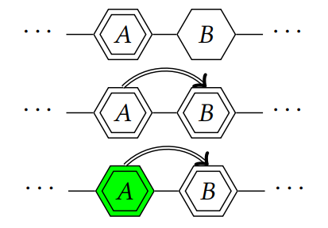
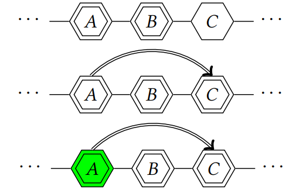
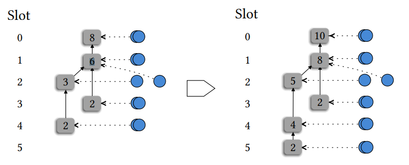
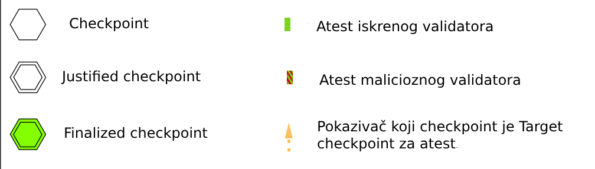
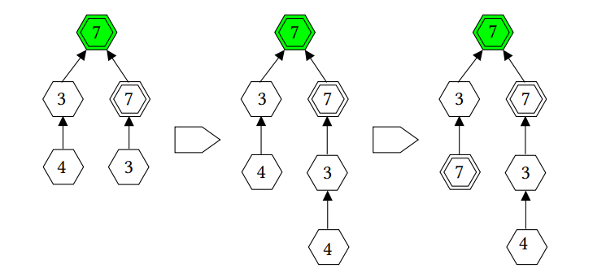
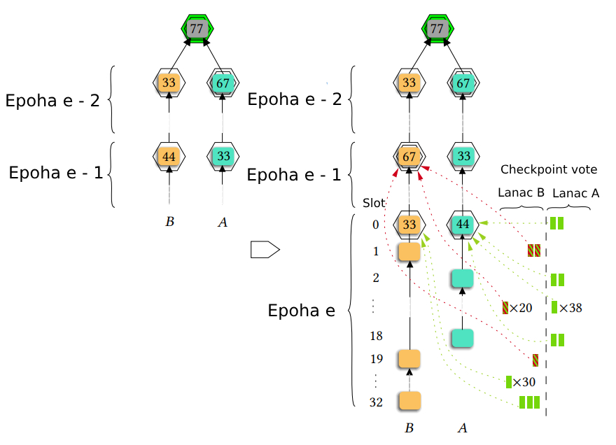

## Liveness attack

U kontekstu blockchaina, liveness napadi su napadi u kojima maliciozni korisnik remeti normalan i redovan rad mreže, tako što cilja da ošteti mogućnost sistema da napravi progres i postigne konsenzus. Uglavnom funkcioniše tako što cilja da spreči ili odloži potvrde transakcija, kreiranje novih blokova ili izvršavanje smart contract-a.
u daljem tekstu biće opisan primer "Bouncing"[[21]](https://arxiv.org/pdf/2210.16070.pdf) liveness napada u Ethereum PoS mehanizmu. Kako bi se precizno opisao napad, prvo ćemo definisati osnovne pojmove unutar mehanizma.

### Osnovni pojmovi

_BlockTree_ - blockchain se može predstaviti kao stablo u kojem svaki blok referencira prethodni, odnosno svog roditelja. Koren stabla predstavlja Genesis Blok. Među različitim granama stabla, protokol odabira jedinstvenu granu, odnosno lanac, na koji će se nadovezivati, pomoću takozvanog "fork choice" pravila. Izabrani lanac se naziva "candidate chain"

_Parcijalno sinhronizovan model_ - model koji posle nekog definisanog vremena (Global Stabilization Time (GST)) postaje sinhronizovan. Postoji neka konačna vremenska granica za transfer delay.

_Candidate chain_ - lanac naznačen kao onaj na koji se nadograđuju blokovi po "fork choice" pravilu. Uzimajući u obzir pogled iz gledišta poštenog validatora i, lanac na koji se i obazire nazivaćemo Ci. Blokovi u ovom lancu mogu biti finalizirani ili ne. (finalized)

_Finalized block_ - Blok je finaliziran za validatora ako i samo ako blok ne može biti opozvan, odnosno trajno je zabeležen u lanac Ci. Takođe svi prethodnici finaliziranog bloka su finalizirani.

_Finalized chain_ - finalizirani lanac je lanac koji se sastoji od samo finaliziranih blokova. Finalizirani lanac je uvek prethodnik candidate lanca Ci.

_Slotovi_ - vremenski intervali, u ovom slučaju konrkretno u trajanju od 12 sekundi. Obeleženi su uzastopnim brojevima, gde je prvi obeležen brojem 0. Enkapsuliraju se u epohe. Slot predstavlja period u kojem proposer ima priliku da kreira blok. Validatori se biraju za svaki slot i oni imaju odgovornost da proposuju ili atestiraju blokovie u tom periodu.

_Epoha_ - konstruisana od 32 slota, tako da u ovom slučaju traje 6 minuta i 24 sekunde. Bitno svojstvo epohe je checkpoint.

_Checkpoint_ - predstavlja skup bloka i epohe, u daljem tekstu naglašeni sa (b, e), gde b predstavlja blok iz prvog slota epohe e.

_Validators & Committees_ - Validatori mogu dve uloge. Proposer i Attester. Proposer predlaže blok u specifičnom slot-u. Ova uloga se pseudo random dodeljuje na 32 validatora u epohi (jedan za svaki slot).
Uloga atestera je da proizvede atest (potvrdu, dokaz) koji deli pogled validatora na lanac. Ova uloga je data jednom po epohi svakom validatoru.
U svakoj epohi, validator je dodeljen jednom komitetu atestera. Komitet predstavlja podskup skupa validatora. Svaki validator pripada samo jednom komitetu. Svaki komitet je povezan sa jednim slotom. U trajanju slot-a, svaki član komiteta će morati da objavi atest koji ukazuje na njegov pogled na lanac.
Drugim rečima, u trajanju epohe, svi validatori su atesteri jednom, i imaju malu šansu da budu proposeri (32/n).

_Vote & Attestation_ - Postoje dva tipa glasanja u Ethereum PoS, block vote i checkpoint vote. Poruka koja sadrži ova dva glasa naziva se attestation. U epohi, svaki validator mora da napravi jedan atesttation.
Checkpoint vote se koristi kako bi se finalizirali blokovi, i proširio finalizirani lanac.
Block vote se koristi kako bi se odredio candidate lanac.

_FinalityGadget_ - mehanizam čiji je cilj da finalizira blokove. Pomoću njega finalizirani lanac raste bez obzira na proizvodnju blokova. Ovim razdvajanjem procesa finalizacije lanca i produkcije blokova postiže se dostupnost blokova čak i kada je proces finalizacije uspoden. Mehanizam funkcioniše na nivou epohe. Umesto da finalizira blok po blok, mehanizam koristi checkpoint vote-ove da finalizira čitave epohe.

_Justification_ predstavlja korak kojim se postiže finalizacija. Radi sa checkpoint-ima na nivou epoha. Justifikacija se dešava zahvaljujući checkpoint glasovima. Checkpoint glasovi sadrže par checkpoint-a. Checkpoint Source i Checkpoint target.
Kod checkpoint glasova, možemo sabrati sumu zaloga (stake-a) validatora koji su objavili glas sa istim Source i Target checkpoint-ima. Ukoliko ti validatori koji kontrolišu 2/3 ukupnog stake-a naprave isti glas, onda kažemo da taj glas ima Supermajority link od Checkpoint Source do Checkpoint Target. Onda se target checkpoint kaže da je postao Justified.

_Finalization_ - proces čiji je cilj da finalizira checkpoint-e, i tako nadogradi finalizirani lanac. Checkpoint-i moraju biti Justified pre nego što mogu biti finalizirani. Proces finalizacije može se predstaviti kroz dva scenarija koja mogu dovesti do finalizacije.

Prvi scenario prikazuje kako checkpoint može biti finaliziran u dve epohe (najmanji broj epoha potreban za finaliziranje).
Scenario 1:

1. Neka su A = (a, e) i B = (b, e + 1) checkpointi (skup (blok, epoha)) dve uzastopne epohe, i kažemo da je A checkpoint justified.
2. Supermajority link se desi između checkpointa A i B gde je A source, B target. Ovime, checkpoint B postaje justified.
3. Ovime checkpoint A postaje finaliziran (finalized)

Ovaj scenario je ilustrovan na sledećoj slici
 

 

Sleceći scenario opisuje kada su dva uzastopna checkpoint-a justified ali nisu finalizirana. Ovo znaći da je trenutni najveći justified checkpoint (u prethodnom primeru B) nije bio justified sa supermajority link-om, a imajući A kao svoj source. Onda se dešava nova justifikacija gde source i target checkpoint imaju maksimalnu razdaljinu (2 epohe) kako bi source bio finaliziran. Potrebno je naglasiti da za ne postoji maksimalna razdaljina između checkpoint-a kako bi bili justified. Limit od 2 epohe se odnosi samo na proces finalizacije.

Scenario 2:

1. Neka su A = (a, e), B = (b, e + 1) i C = (c, e + 2) checkpoint-i uzastopnih epoha takvih da su A i B justified. Nije ostvaren Supermajority link između A i B, tako da A ne može biti finaliziran kao u prethodnom primeru.
2. Sada se supermajority link dešava između A i C gde je A source, a C target. Ovime checkpoint C postaje Justified.
3. A sada postaje finaliziran
    

 

_Fork choice rule & Block proposition_ - fork choice dozvoljava validatoru da odluci candidate chain u zavisnosti od svog pogleda na BlockTree i stanje checkpointa. Ethereum PoS Fork choice rule se zove LMD GHOST (Greedy Heaviest-Observed Sub-Tree(GHOST)).
U epohi, svaki validator mora napraviti jedan block glas na blok koji smatra glavom candidate chain-a prema svojoj tacki gledista. Kako bi se izabrala glava candidate lanca, fork choice rule radi sledece:

1. Prodje korz listu validatora i pregleda poslednji block vote od svakog
2. Za svaki block vote, doda W težinu svakom bloku koji ima glasova da bude potencijalni naslednik. Težina W je proporcionalna udelu u stake-u validatora koji su izglasali taj blok.
3. Počinje od bloka justified checpoint-a sa najskorijom epohom, i nastavlja lanac nizajući blokove sa najvećom težinom W. Vraća se blok koji nema naslednika. Taj blok je glava (head) candidate lanca.
    

 

Na slici sa leve strane vidimo slotove, dok plavi krugovi predstavljaju block vote-ove. Ukoliko pretpostavimo da je težina W svih glasove W=1, u levom primeru za glavu (head) candidate lanca će biti izabran blok u slotu 4, a u desnom blok u slotu 5, koji se nadovezao na prethodnu glavu candidate lanca.

_Pseudo-Randomness_ - Rešenje koje koristi Ethereum kako bi podržao random vrednosti unutar konsenzusa se naziva RANDAO. To je mehanizam koji kreira pseudo-random brojeve na način pogodan decentralizovanom sistemu. Funkcionište tako što sakuplja različite pseudo-random izvore i miksuje ih.

_Seed creation_ - svaka epoha generiše seed. On se kreira pomoću proposer validatora i pomenutoj epohi. Svaki validan blok sadrži polje randao_reveal. Seed je zapravo hash vrednost nad funkcijom XOR svih randao_reveal vrednosti u epohi, plus broj epohe.
Kako bi se izbegla manipulacija u kreiranju seed-a, randao_reveal svakog bloka mora biti digitalni potpis specificnih podataka. Podatak koji se potpisuje je broj epohe. Svako može da proveri da je potpis od proposer-a bloka i da su vrednosti tačne.

_Seed utilization_ - Mehanizam koji koristi seed je izmenjena verzija swap-or-not algoritma, i koristi se za mešanje liste validatora, i dodaje nove uloge validatorima u zavisnosti od njihovih razmešanih indeksa. Ovaj algoritam ima dve svrhe unutar Ethereum-ovog PoS-a. Da bi se odabrao Proposer i da bi se odabrao Committee.

### Liveness attack - Bouncing

Kada smo utvrdili osnovne pojmove, prelazimo na opis Bouncing napada, koji odlaže finalitet u parcijalno sinhronizovanoj mreži, nakon što se desi GST. Ovaj napad se može desiti čak iako je manje od 1/3 validatora maliciozno.
 

 

Ovaj napad je vrsta liveness napada gde se sufiks lanca menja divergentno između dva candidate lanca, i tako se sprečava finaliziranje bilo kog checkpoint-a. Iskorištava se činjenica da se candidate lanac započinje od justified checkpoint-a sa epohe sa najvećim brojem epohe (najskorije). Maliciozni validator može da podeli mišljenje iskrenog validatora tako što je novi checkpoint pretvoriti u justified, nakon što iskreni validatori već objave svoj glas (naprave atest), u vreme asinhronog perioda (pre GST).

Bouncing napad je moguć kada postoji justifiable checkpoint na drugoj grani od one izabrane od strane fork choice rule-a sa skorijom epojom od trenutnog najskorijeg justified checkpoint-a. Justifiable checkpoint je checkpoint koji može postati justified samo dobijanjem checkpoint glasova od malicioznih validatora. Ukoliko se ova situacija desi, maliciozni validatori mogu naterati iskrene validatore da glasaju za drugi checkpoint, na drugoj grani, ostavljajuci justifiable checkpoint, na koji bi malicioziozni validatori mogli opet da se oslone, kako bi ponovili ovu situaciju, i naterali iskrene validatore da skakuću između dva lanca (odatle naziv Bounce), i na taj način ni jedan checkpoint ne bi mogao biti finalizovan.
 

 

Na slici iznad vidimo jednostavan primer gde ima samo 10 validatora, od kojih su 3 maliciozna. Za pojednostavljen primer, svi imaju isti udeo u Stake-u, tako možemo reći da je W = 1. Da bi se napad desio, mora postojati justifiable checkpoint u skorijoj epohi od poslednjeg justified checkpoint-a.

1. Imamo situaciju gde se desilo grananjue. Checkpoint is justified na jednoj grani i checkpoint novije epohe je justifiable na drugoj. Na kraju smo druge epohe u kojoj iskreni validatori imaju podeljene glasove na svakoj strani.
2. Dostiže se GST na početku četvrte epohe i 4 iskrena validatora su pravično glasala.
3. U ovom koraku maliciozni validatori i glasaju za checkpoint na konkurenskoj grani, i time justifikuju ostavljeni checkpoint, i menjaju najveći justified checkpoint. Ponavljajući ovaj proces, može se nastaviti u nedogled i blokirati finalizacija lanca.
    

 

U detaljnoj verziji napada imamo 100 validatora, od kojih je 23 maliciozno. Blok u checkpointu korespondira bloku u skupu tog checkpoint-a. Broj u šestouglu označava broju validatora koji su glasali za checkpoint kao target. Pomoću legende napada na početku pasusa možemo videti koji su glasovi maliciozni, a koji iskreni.

1. Počinjemo od epohe e-1, koja se završila i stiglo smo do GST. Candidate lanac je lanac A zato što checkpoint sa najveće epohe se nalazi na lancu A.
2. U drugom koraku, checkpoint glas objavljen u epohi e može promeniti poslednji justified checkpoint, tako da candidate lanac postaje lanac B, umesto prethodnog lanca A. Mlaiciozni validatori su objavili svoje glasove za prethodnu epohu, u vreme trajanja epohe e. Oni svoj poslednji glas šalju u slotu 23 epohe e, kada je checkpoint na lancu A dostigao 44 glasa i time postao justifiable (idalje nije justified, ali može biti u narednom koraku, što malicioznim napadačima odgovara). Manipulišu glasovima i izvegavaju finalizaciju bilo kog checkpoint-a.

### Patch

Rešenje ovog problema je uključivanje pravila u protokol da validatori ne mogu promeniti svoj glas u pitanju justified checkpoint-a nakon što je prošao određeni deo epohe.
Cilj patch-a je sprečiti mogućnost da iskreni validatori ostave checkpoint u stanju justifiable. Kako bi se ovo desilo, patch mora da zaustavi validatore od promene njihovog gledišta na pre nego što 1/3 validatora već objavi svoj checkpoint vote. Ovaj uslov je proizašao iz pretpostavke da broj malicioznih validatora iznosi manje od 1/3 validatora po epohi. Da bi se primenilo pravilo, patch označava broj slotova posle kojih iskreni validatori ne mogu promeniti svoje mišljenje o checkpoint-u.
Ovaj proces se naziva "fixation of view", i uvodi konstantu SAFE_SLOTS_TO_UPDATE_JUSTIFIED u kodu i označava do kad validatori mogu da se odluče o justified checkpoint-u.
