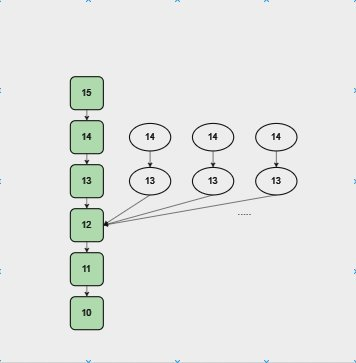
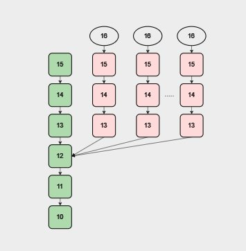

## Napadi iscrpljivanja resursa [[14]](https://fc19.ifca.ai/preproceedings/180-preproceedings.pdf)

Napad iscrpljivanja resursa se odnosi na iskorištavanje procesa validacije PoS blokova, što dovodi do iscrpljivanja resursa na sistemu žrtve. Određene kriptovalute ne validiraju na adekvatan način dokaz o ulogu pre nego što dodele resurse podacima primljenim od vršnjaka (to je drugi čvor u mreži sa kojim se određeni čvor povezuje i komunicira).   Zlonamerni akter to može iskoristiti ovu ranjivost iako ne poseduju nikakav ulog niti privilegovanu mrežnu poziciju. Napad se obavlja slanjem pogrešno formiranih, tj. deformisanih blokova koje žrtva zatim skladišti u RAM-u ili na disku. Rezultat toga je pad sistema žrtve i degradacija performansi zbog akumulacije nevažećih podataka. Pad sistema i degradacija performansi mogu poremetiti normalan rad mreže, što može dovesti do potencijalnih finansijskih gubitaka i gubitaka poverenja među korisnicima i zainteresovanim stranama. Takođe, napadač može pokušati da iskoristi ove napade kako bi izveo neki složeniji napad. Na primer, ako bi napadač naterao čvor da prihvati lažni lanac blokova kao validan, mogao bi potencijalno da izvrši dvostruko trošenje ili neki drugi napad.

### Napad na RAM

Kod ovog napada cilj napadača je da stvori lažna zaglavlja blokova koja će čvor prihvatiti kao validna i sačuvati ih. Napad započinje odabirom proizvoljne tačke razdvajanja u mreži i konstrukcijom zaglavlja koje proširuje ovaj blok. Što znači da napadač bira tačku u mreži odakle će granati novi lanac blokova, i zatim stvara lažna zaglavlja blokova koja se nadovezuju na ovu tačku.   
Na slici ispod je prikazan primer kreiranja lažnih zaglavlja. Zelenom bojom je označen trenutni lanac, dok su belom bojom označena zaglavlja koja napadač kreira.  

Da bi napad bio efikasan, napadač šalje veliki broj lažnih zaglavlja odjednom, pazeći da lanac lažnih blokova ne postane duži od trenutnog glavnog lanca, jer u tom slučaju moglo bi se desiti da čvor prepozna napad i prekine vezu sa napadačem.

### Napad na disk

Kod ovog napada cilj je stvoriti lanac lažnih blokova koje će čvor prihvatiti kao validne i sačuvati ih. Napadač stvara lanac blokova, počevši od proizvoljne tačke u blockchainu i dostiže tačno do dužine glavnog lanca. Svaki blok je maksimalno popunjen lažnim transakcijama. Transakcije imaju proizvoljne vrednosti za svoje potpise i reference na ulazne transakcije. Pre slanja blokova, napadač šalje samo zaglavlje blokova. Ovo je bitno jer čvor neće prihvatiti blok osim ako nije eksplicitno zatražen. Kada lanac zaglavlja dostigne istu dužinu kao glavni lanac, čvor će zatražiti sve blokove. Puna validacija bloka se aktivira samo u slučaju reorganizacije bloka, a kako napadač šalje samo blokove koji ne premašuju dužinu trenutnog lanca, žrtva nikada ne vaidira blok.  
Na slici ispod je prikazan primer kreiranja laznih blokova gde je trenutni lanac označen zelenom bojom, lažni blokovi koje napadač kreira su roze boje dok su zaglavlja označena belom.

### Mitigacije

Neka jednostavna rešenja za zaštitu su:
- Postavljanje kontrolnih tačaka na svakih K blokova, tako da čvor ne prihvata blokove koji se granaju dublje od K blokova
- Onemogućavanje podrške za zaglavlje i korišćenje provere kako bi se utvrdilo da li je viđena transakcija coinstake (ova transakcija pokazuje ulog validatora u mreži). Ovo znači da bi se moglo onemogućiti korišćenje zaglavlja blokova, i umesto toga koristiti provera baze podataka transakcija (TxDb) da bi se videlo da li je već viđena određena transakcija coinstake. Iako nije savršena mera, zahteva od napadača da ima neki ulog u prošlosti
- Pravljenje UTXO snimaka svakih K blokova i validacija svih blokova premeštanjem strukture od najbližeg snimka do tačke razdvajanja. Odnosno, trebalo bi da se pravi UTXO snimak trenutnog stanja svih neiskorišćenih izlaznih transakcija svakih K blokova, i zatim kada je potrebno validirati blokove, može se početi od najbližeg snimka do tačke gde se lanac grana, umesto da se proverava svaki blok od početka
