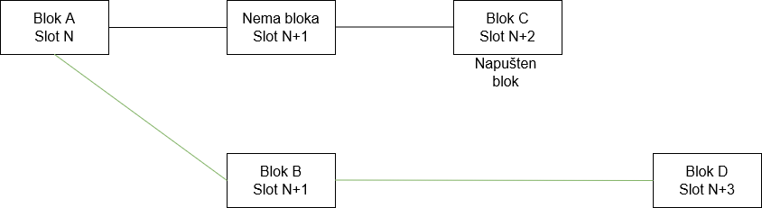

## Napadi na Ethereum

Česta je zabluda da uspešni napadač može generisati novi ether ili isprazniti [ether](https://www.investopedia.com/terms/e/ether-cryptocurrency.asp) sa proizvoljnih računa. Ništa od toga nije moguće, jer sve transakcije izvode klijenti na mreži. Da transakcije budu validne moraju biti validne(na primer transkacije su potpisane privatnim ključem pošiljaoca,pošiljalac ima dovoljno sredstava za transakciju...) ili će se jednostavno poništiti. Postoje tri vrste ishoda koje napadač može očekivati: reorganizaciju(reorgs), dvostruku finalnost(double finality) ili kašnjenje finalnosti(finality delay).  
"Reorg" je premeštanje blokova u novi redosled, možda sa dodatkom ili oduzimanjem blokova u lancu. Zlonamerna reorganizacija blokova može neke blokove uključiti a neke isključiti iz lanca i time potencijalno može omogućiti double spending ili izvlačenje vrednosti iz transakcija. Reorganizacija može isključiti određene transakcije iz glavnog lanca i time može cenzurisati nekoga. Najekstremnija forma reorganizacije je "finality reversion", ona uklanja ili menja blokove koji su prethodno ozvaničeni. To je moguće ako je napadač uništio više od trećine udela(stake-a). 
"Double finality" je malo verovatno, ali nimalo bezazleno, stanje u kom se dva forka istovremeno finalizuju i time stvore tajni raskol u lancu. Ovo je teoretski moguće ako napadač želi da rizikuje 34% ukupnog ether-a. Da bi se ovo razrešilo potrebno je da zajednica odluči koji lanac treba pratiti, a koji odbaciti. 
"Finality delay" je napad koji pokušava da spreči mrežu da finalizuje delove lanca. Bez finalnosti lanca, teško je verovati finansijskim aplikacijama koje koriste Ethereum. Cilj ovog napada nije profit(verovatno), već je cilj poremetiti Ethereum. 

### Napadi

Bilo ko može imati Ethereum-ov klijentski softver. Da bi klijent mogao da ima i ulogu validatora mora ostaviti 32 ether-a kao depozit. Kao validator korisnik aktivno učestvuje u prosišerenju Ethereum-ove mreže dodavanjem i potvrđivanjem novih blokova. Validator sada ima mogućnost da radi ispravno i povećavati svoj udeo putem nagrada, ili može pokušati da manipuliše procesom u svoju korist i time rizikujući svoj trenutni udeo. Jedna od mogućnosti za pokretanje napada je akumuliranje što većeg udela i onda to koristi za nadglasavanje ispravnih validatora. Što je veći udeo napadača, to je veća i njegova glasačka moć. Većina validatora ne može skupiti dovoljno veliki udeo da bi bila uspešna u ovakvom napadu, te mora koristiti drugačije metode za napad.
Svi napadi gde napadač ima mali udeo su varijacije na dva tipa ponašanja: nedovoljna aktivnost(neuspešna potvrđivanja/predlaganja blokova ili kašnjenje u tome) ili prekomerna aktivnost(predlaganje/potvrđivanje previše blokova u jednom slotu). Ovakve akcije sistem lako prepozna i obradi, ali postoje i drugačiji načini za napade.
 
#### Opisi napada
Postoji nekoliko radova koji objašnjavaju napade na Ethereum koji uspevaju da urade reorganizaciju ili "finality delay". Ovi napadi se obično oslanjaju na to da napadač zadrži određene informacije za sebe(i ne prikaže ih ostalim validatorima) i zatim ih na određeni način i pušta ih u određenom trenutku. Cilj ovakvih napada je zameniti neke blokove u glavnom lancu. Na primer u [18](https://arxiv.org/pdf/2203.01315.pdf), prikazano je da napadač može stvoriti i potvrditi blok(B) za određeni vremenski slot(n+1), ali on informacije o bloku čuva za sebe i ne deli ih s drugim čvorovima u mreži, umesto toga on čuva taj blok do sledećeg slota(n+2). Kada ispravni validator predloži blok(C) za slot n+2, istovremeno, napadač šalje blok koji je zadržao(zajedno sa potvrdama za njega),i uz to napadač povrđuje da je blok B vezan za slot n+2(suštini negirajući postojanje bloka C). Kada dođe na novi blok D(koji je izdat od strane iskrenih validatora) forking algoritam nadovezuje blok D na blok B umesto na C. Tada je napadač uspeo da izbaci blok C iz slota n+2 na glavnom lancu i time izve ex ante reorganizaciju. Napadač sa 34% udela ima dobre izglede za izvršenje ovakvog napada, u teoriji je moguće to izvesti i sa 30% [18](https://arxiv.org/pdf/2203.01315.pdf). Izgled lanca prikazan je na slici ispod. 
 
Složeniji napad može podeliti ispravne validatore u dve grupe koje imaju razlite poglede u head lanca. Ovo je poznato kao balancing attack. Napadači čekaju svoju šansu za objavljivanje bloka, i kada dođe njihovo vreme on predloži dva bloka. Jedan se pošalji jednoj, a drugi drugoj polovini validatora. Dvosmislenost u blokovima bi bila detektovana i napdač bio kažnjen i izbačen iz sistema, ali bi i dalje postojala dva bloka koja čekaju validaciju. Istovremeno ostali validatori(napadači) zadržavaju svoje glasove. Zatim, čim se algoritam fork-ovanja izvrši, selekivnim glasanjem za jedan ili drugi fork napdači izglasavaju jedan od 2 forka. Ovo može trajati beskonačno dugo, i pošto nijedan od fork-ova ne može dostići dvotrećinsku većinu, ne dolazi do finalnosti. Sličan način koristi i bouncing attack, on je opisan u [liveness attack](liveness-attack.md).
Oba ova napada se oslanjaju na to da napadači imaju veoma preciznu kontrolu nad vremenom slanja poruka preko mreže, što je obično malo verovatno. Bez obzira na to, algoritam ima odbrambene mehanizme ugrađene u protokol koji su vezani za to. Jedan od njih je da se pravovremene poruke "više" računaju od poruka koje su pristigle kasnije. A da bi se sistem odbranio od bouncing napada, alogritam izbora fork-a može preći na alternatvni granu samo tokom prve trećine slotova u epohi. Ovo onemogućava napadača da skupi glasove za kasniju upotrebu. Pretpostavlja se da većina iskrenih validatora glasa u prvoj trećini epohe. 
Sledeća vrsta napada naziva se avalanche(mećava) napad. On je opisan u [[19]](https://arxiv.org/pdf/2203.01315.pdf). Da bi pokrenuo ovakav napadač mora kontrolisati nekoliko uzastopnih predlagača blokova. U svakom slotu za predlog bloka, napadač bi zadržavao blokove, dok glavni lanac bez tih blokova ne postigne istu težinu kao lanac sa tim (zadržanim)blokovima. Zatim se zadržani blokovi šalju i stvaraju maksimalnu dvosmislenost. Autori [[19]](https://arxiv.org/pdf/2203.01315.pdf) kažu u radu da odbrane od prethodna 2 napada ne sprečavaju sve avalanche napade, ali autori koriste idealnu verziju algoritma za izbor fork-a(ima [GHOST](https://www.geeksforgeeks.org/what-is-ghost-protocol-for-ethereum/) ali nema [LMD](https://coinmarketcap.com/academy/glossary/lmd-ghost)).

Avalanche napad je sprečen LMD-GHOST algoritom i to LMD delom. LMD(latest-message-driven)  se odnosi na tabelu koju svaki validator čuva i u njoj se skladište samo poslednje poruke primljene od ostalih validatora. Polja u tabeli su ažurirana samo kada poruka dođe iz kasnije slota od onog koji već postoji u tabeli za određenog validatora. U praksi, to znači da se za svaki slot čuva samo prva poruka koja je primljena od validatora, dok se ostale poruke ignorišu. Tj. ne može doći do dvosmislenosti poruka i time se sprečavaju ovakvi napadi. Ovaj napad je opisan na [Avalance attack](https://ethereum-org-fork.netlify.app/developers/docs/consensus-mechanisms/pos/attack-and-defense). Više o ovakvim napadima može se čuti na [FC22: Three Attacks on Proof-of-Stake Ethereum](https://www.youtube.com/watch?v=IMOKeUJVWPs).  
POS na Ethereum-u bira jednog validatora iz pool-a validatora da predloži blok za sledeći slot. Ovo može biti izračunato pomoću javno poznate funkcije i moguće je da napadač identifikuje sledećeg validatora koji predlaže blok malo pre nego što je on odabran. Tada, napadač može izvesti DOS(Denial of service) napad na njega tako što bi ga spamovao i blokirao njegovu komunikacijama sa ostalim članovima mreže. Ostalim članovima mreže bi izgledalo da je žrtva offline i slot prosto ostao prazan. Ovakav napad može biti forma cenzure prema čvoru koji bi trebalo da predloži blok. Ovaj napad izbegava se implementacijom SSLE(secret leader elections) i time sledeći predlagač bloka ne bi unapred poznat. Ovo još uvek nije implementirano, ali je u aktivnom istraživanju i razvoju.