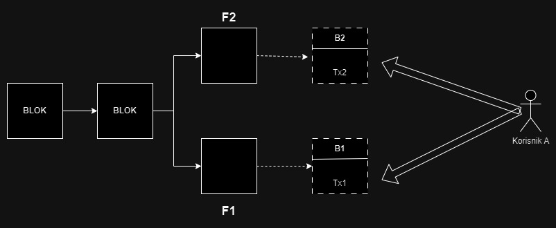

# Nothing at Stake

## Uvod

Nothing at stake problem se dešava zbog prirode PoS mehanizma koja omogućava jeftino proizvođenje novih blokova unutar mreže. U PoW mehanizmu, kada nastane "fork" grananje lanca blokova, pošto je kopanje bloka skupo i zahteva puno računarskih resursa i vremena, kopači nemaju želju da nastave kopanje na neprihvaćenoj putanji fork-a, već im je u interesu da što pre nastave da kopaju na grani prihvaćenoj u celokupnoj mreži, kako bi se izborili za nagradu koju nosi uspešno iskopan blok. U PoS, kopanje, odnosno "forge"-ovanje blokova nije skupa akcija. Resursi koje zahteva ova akcija su hiljadama puta manji, nego u PoW sistemu, tako da validatori Mogu da se fokusiraju na kopanje nekoliko fork-ova odjednom[[8]]. Ovo otvara priliku za narušavanje integriteta mehanizma.

## Primer

U interesu validatora je da dođe do nagrade za napravljen blok, tako da validatori iskorištavaju mogućnost kreiranja i potpisivanja bloka na više fork-ova simultano. Ovime se otvara mogućnost da za glavni lanac bude prihvaćena grana fork-a u kojoj se desila maliciozna transakcija. Na primer, uzmimo situaciju gde imamo transakciju između dva učesnika u PoS blockchain sistemu, učesnika "A" i učesnika "B". Recimo da učesnik "A" želi kriptovalutama da plati učesniku "B" za neki fizički proizvod ili uslugu. Predpostavimo da je učesnik "A" maliciozni korisnik koji želi da iskoristi pomenutu slabost mehanizma. Potrebno je da on uradi dve stvari. Potrebno je da uradi dve transakcije. Jedna je validna transakcija, koju ćemo nazvati Tx1 koja prebacuje novac iz novčanika korisnika "A" u novčanik korisnika "B", i jednu malicioznu transakciju, Tx2, gde korisnik "A" prebacuje sredstva na svoj novčanik. Ukoliko se ova akcija desi u tačno vreme kada se dešava "fork" u blockchain lancu, a dešava se često, može se desiti sledeći slučaj. Tx1 će biti zapisana transakcija unutar bloka B1 koji je fork-u F1, a Tx2 će biti zapisana unutar bloka B2 koji se nalazi u fork-u F2. Ova situacija je ilustrovana na slici.

Pošto je u prirodi PoS mehanizma da zbog jeftinoće kopanja blokova validatori validiraju više fork-ova, obe transakcije će biti validirane i oba bloka će zatim biti iskopana. Upravo lakoća i jeftinoća kopanja i validiranja blokova dozvoljavaju malicioznom korisniku A da i sam bude validator. U tom slučaju, on može izabrati da nastavi da kopa blokove koji se nižu unutar fork-a F2, čime će F2 postati vodeći fork, jer je i najduži. Ukoliko F2 postane opšteprihvaćen fork u mreži, maliciozni korisnik A je ispunio svoj cilj, i dobio je dobra korisnika B potpuno besplatno.
Takođe, i u slučaju da maliciozni korisnik nije validator, sve što je potrebno je da pronađe način da ubedi validatora da izabere da nastavi da validira na grani na kojoj je maliciozna transakcija.

## Primeri u mrežama i način prevencije

#### Nxt

Primer PoS blockchain mreže koja se uopšte nije zaštitila od ovakvog slučaja može se uzeti Nxt. Validatori su potpuno mogli da ignorišu odluku mehanizma za odabiranje fork-ova i nastave kopanje po svom. Štaviše, pošto je dokaz o podobnosti validatora bio determinističan za svakog validatora, moglo se predvideti koji validator će generisati validne blokove u budućnosti. Ovo se često naziva "Transparent forging", i otvara dodatne bezbednosne propuste unutar blockchain mreže, jer dozvoljava napadačima da selektivno odaberu sledećeg validatora kojeg će kompromitovati.

#### Slasher

Slasher je uveo bezbednosni mehanizam koji zahteva da validatori naprave depozit koji će zatim biti zaključan na određeni period. U slučaju da su dva konfliktna bloka, u istom nivou potpisana od strane istog validatora, taj validator će izgubiti svoj depozit. Na taj način mreža kažnjava validatore koji simultano kreiraju blokove u konfliktu na nekoliko grana.

#### Bitshares

BitShares prihvata slično rešenje kao Slasher. Ovde, ukoliko se validator ponaša maliciozno, on će izgubiti mogućnost da bude validator i generiše blokove u budućnosti.

#### Zaštita

Ostali sistemi bazirani na depozitu kažnjavaju validatora čak i ako glasa za "pogrešan" fork, pretpostavljajući da može biti samo jedan validan fork. Sva ovakva rešenja zamrzavaju značajanu svotu sredstava (depozita) u mreži. Ali čak i depozit ne pruža potpunu sigurnost da su validatori iskreni. Validatori mogu ostvariti profit kada kreiraju konfliktujuće blokove sa double-spending transakcijama čija vrednost prevazilazi vrednost depozita koji su založili, tako da na kraju ipak profitiraju od napada.
