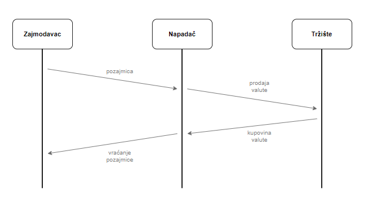
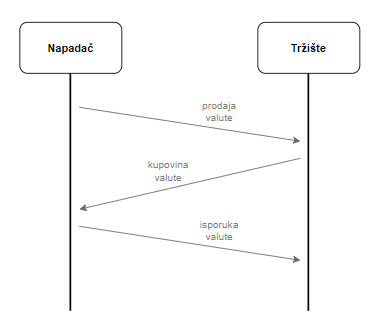
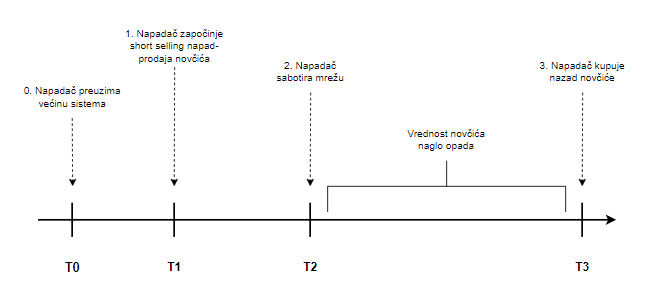

## Short selling napad
Kod PoS sistema, napadač mora da kontroliše 51% kriptovalute kako bi izveo [napad od 51%](../napadi/51%25-napad.md) i dolazi u rizik da izgubi ili umanji ulog ukoliko napad ne uspe, što ga obeshrabruje da pokrene napad. Čak i ako napad uspe, vrednost PoS bazirane kriptovalute će pasti, što znači da bi napadač, kao neko ko ima najveći ulog, najviše i izgubio. Međutim, jedan od načina da napadač profitira od ovog napada jeste izvođenje short selling napada (shorting) [[16]](https://sci-hub.se/https://dl.acm.org/doi/abs/10.1145/3410699.3413791).   
Short selling je finansijska strategija u kojoj investitor pozajmljuje imovinu, prodaje je po trenutnoj tržišnoj ceni, a zatim je otkupljuje nazad po nižoj ceni i vraća pozajmljivaču. Razlika između prodajne i kupovne cene je profit investitora. Tokom tog vremenskog intervala, tržišna cena imovine se menja. Ako tržišna cena imovine padne tokom vremenskog intervala, prodavac ostvaruje profit. Suprotno tome, ako ne, prodaja na kratko rezultira gubitkom. Maksimalni profit od prodaje na kratko je tržišna cena u trenutku kada prodavac pozajmljuje imovinu. To je zato što je najniža moguća cena na koju imovina može pasti nula, pa je maksimalni profit jednak početnoj ceni imovine. Maksimalni gubitak od prodaje na kratko je teoretski neograničen, jer nema gornje granice za koliko tržišna cena imovine može porasti.   
 
Slika 1. Short selling  
Postoje dve vrste ovog napada. Prva, short selling prikazana je na slici 1 i opisana je u tekstu iznad, a druga je naked short selling (slika 2). Kod naked short selling-a prodavac prodaje imovinu bez pozajmljivanja. Odnosno, prodaja trguje imovinom koja nije postojala na tržištu, i samim tim dolazi do zloupotrebe tržišta.  
 
Slika 2. Naked short selling  
Short selling strategija ima za cilj da napadač  može manipulisati tržištem kriptovaluta na sličan način kao što investitori koriste shorting da bi profitirali od pada cene akcija. Međutim, za razliku od tradicionalnog shorting-a, ovaj napad ne uključuje pozajmljivanje i prodaju stvarnih akcija, već se fokusira na manipulaciju sistemom PoS kriptovaluta kako bi se izazvao pad njihove vrednosti.  
Short selling napad se zasniva na dve ideje. Prva ideja je da napad ostvaruje profit od gubitka tržišne vrednosti, tj od prodaje velike količine valute koja izaziva nestabilnost u sistemu. A druga je da napadač ne mora da poseduje 51% ukupne količine novčića, već treba da poseduje 51% srednjeg odnosa ulaganja ukupne količine novčića. Srednji odnos ulaganja ukupne količine novčića se odnosi na prosečni procenat novčića koje drže pojedinci ili entiteti koji su uložili u mrežu. Svi vlasnici neće možda uložiti sve svoje novčiće. Na primer, ako jedan vlasnik uloži 50% svojih novčića, a drugi 100%, srednji odnos ulaganja bi bio 75%. Ovo je moguće jer je odnos uloženih novčića prema vlasničkim novčićima ograničen zbog finansijske likvidnosti. Finansijska likvidnost se odnosi na to da napadač može da proda veliki deo svoje kriptovalute bez značajnog uticaja na tržišnu cenu.   
 
Slika 3. Strategija napada  
Strategija napada se sastoji od tri koraka, prikazana na slici 3.  Pretpostavka je da napadač poseduje 51% ukupnog uloga u mreži, to predstavlja početnu tačku za izvođenje napada u vremenskom intervalu T0. Zatim napadač prodaje N novčića na tržistu. Broj novčića mora biti dovoljno velik da bi se ostvario profit na kraju napada. Sabotiranje sistema znači da napadač namerno ometa normalno funkcionisanje mreže kriptovalute, na primer generisanjem praznih blokova što može dovesti do pada vrednosti kriptovalute. Tržišna vrednost valute se smanjila za  𝛽%, a ukoliko se utvrdi da je napadač prekršio pravila, njegov ulog se smanjuje za  𝛾%. Na kraju napadač otkupljuje N novčića na tržištu kada je tržišna cena dovoljno umanjena. Iako je napadač ostvario korist od kratke prodaje, trpi i gubitak zbog umanjenja uloga. Neka bude X količina novčića koje je napadač uložio. Tada je korist 𝛽 × N, a gubitak je (𝛽 × 𝛾 + 𝛽 + 𝛾) × X. Ako je korist veća od gubitka, napad je uspešan. [[17]](https://sci-hub.se/10.1002/cpe.6585)   
Drugim rečima ukratko: napadač ulaže određenu količinu novčića (označeno sa A) u sistem kriptovalute. Zatim, napadač prodaje veliku količinu novčića na tržištu (označeno sa B). Nakon prodaje, napadač sabotira sistem kriptovalute, u ovom slučaju generisanjem praznih blokova. Kako vrednost valute zavisi od njene sposobnosti da obavlja transakcije kada napadač sabotira sistem njena vrednost naglo opada (označeno sa Δ). 
U vremenskom intervalu T3, napadač kupuje novčiće kako bi ih isporučio tržištu za novčiće prodate na kratko. Kao rezultat napadač dobija Δ · (𝐵 - 𝐴). Da bi bio profitabilan, iznos prodaje na kratko 𝐵 treba da bude veći od 𝐴. Stopa deprecijacije (Δ) se odnosi na procenat kojim vrednost kriptovalute opada tokom određenog vremenskog perioda, što veći pad napadač može da izazove (visoka stopa deprecijacije) ostvaruje veći profit.   
Kod ovog napada, najvažniji i najteži deo je priprema. Kada napadač otkupljuje veliki broj novčića njihova cena naglo raste. S druge strane, kada ih prodaje njihova cena naglo pada. Jedan od načina za pripremu ovog napada je da napadač ulaže i prodaje novčiće tokom dužeg vremenskog intervala. Da bi ubrzao proces, napadač može da otkupi isti broj PoS novčića koje prodaje i na taj način, može da obezbedi isti broj prodatih i otkupljenih novčića bez uticaja na cenu PoS valute. Nakon napada, kada dođe do pada vrednosti i smanjenja uloga, količina prodaje mora biti veća od količine uloga.   
Što se tiče načina postižanja većinskog udela, on je opisan u [napadu od 51%.](../napadi/51%25-napad.md)  
Kada je reč o sabotaži, postoji više načina koji bi bili efikasni. [Dvostruko trošenje](#double-spending), dvostruko glasanje i ne glasanje mogu se uzeti u obzir. Na primer, nepošteni validatori mogu glasati za blok koji ne postoji ili je skriven. Oni izvršavaju glasanje, ali neće biti novog bloka. Jedan od načina je i generisanje praznog bloka od strane nepoštenog validatora koji ne sadrži transakcije, rezultat toga je da se nijedna transakcija ne obrađuje. Postoji mogućnost da pravila o smanjenju mogu vrlo brzo smanjiti ulog napadača. Ako se to dogodi, napadači ne mogu održati sabotažu da bi postigli dovoljno umanjenje vrednosti PoS valute. Međutim, napadači i to mogu ublažiti, na primer, mogu rasporediti svoj ulog na više adresa. Raspoređeni ulog na jednoj adresi mora biti dovoljan da ta adresa dobije pravo validatora. Ako napadači pokušaju da generišu više blokova kada jedan od njihovih validatora postane generator blokova, samo će se ulog jednog njegovog validatora smanjiti. 
### Mitigacije
Kao i kod nekih drugih napada, shorting ne može biti rešen samo tehničkim aspektima. Neki od načina za zaštitu su:
- Visok odnos uloga od strane poštenih učesnika. Važno je motivisati učesnike da se ponašaju pošteno kroz podsticaje, kako bi se osiguralo da pošteni učesnici imaju dovoljno uloga. Dobitak poštenih učesnika treba da bude pozitivan i, prema teoriji igara, treba da bude veći od dobitaka koje donose nepoštene strategije.
- Politika kažnjavanja – su pravila koja se primenuju kako bi se sprečili napadi na mrežu. Na primer, napadač koji pokuša da izvede napad može biti kažnjen gubitkom svog uloga ili poništavanje svih sredstava povezanih sa napadačem, što bi moglo smanjiti motivaciju za izvođenje napada
- Društveni troškovi – ovi troškovi se odnose na negativne posledice koje napad može imati na zajednicu koja koristi kriptovalutu. Na primer, ako napadač izvede uspešno napad od 51%, to može dovesti do gubitka poverenja u valutu i može smanjiti njenu upotrebu. Samim tim, gubitkom poverenja opada i motivacija za izvođenje napada

