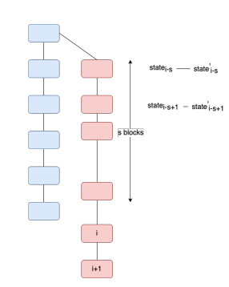

## Stake grinding in PoS

Stake grinding je napad u PoS mehanizmu gde napadač pokušava da manipuliše determinističku prirodu algoritma procesa selekcije validatora, kako bi povećao svoju šansu da on bude izabran da generiše nov blok.
On manipulacijom ulaznih promenljivih koje ulaze u algoritam pokušava da postigne svoj cilj. To znači da može menjati kriptografske potpise, timestamp-ove, ili raditi strateške poteze da bi povećao svoje šanse.
U PoS, heširani potpis možemo predstaviti kao _VRFHash(Ri−1, ti, sk) < threshold_ , gde je Ri-1 random vrednost prethodnog bloka, Ti je vreme, a sk tajni ključ stakeholder-a. a threshold uslov od kojeg hash mora biti manji kako bi blok uspešno bio iskopan. Nothing At Stake napad bi pokušao da iskoristi randomness bloka da iskopa blokove, dok Stake Grinding napad pokušava da obesmisli algoritam nagađanjem različitih secret key-eva i tako brže kreira lanac blokova.

Stakeholder koji je validator bloka i želi da ošteti sistem u svoju korist, može napraviti novi par javnih i tajnih ključeva, i novac koji već čuva prebaciti ponovo sebi na novi novčanik. Može sebi repetitivno prebacivati novac, dok ne dobije određenu kombinaciju i potreban secret key koji će generisati zadovoljavajuću hash vrednost i zadovoljiti uslov bloka, a u bloku napisati sadržaj i transakcije koji on sam želi. Pošto je izabran da iskopa blok, on može plasirati maliciozni blok, koji po svemu zadovoljava uslov pomenut gore. To je pod pretpostavkom da prebaci sredstva sebi dovoljan broj puta i nađe takvu vrednost secret key-a da heš funkcija daje dobar rezultat.

Jedan način da se napad spreči je da se posledjeg stanja distribucije stake-a, koristi stanje pre S blokova. I samo stakeholder-i novca u bloku stanja i-s (i je sadađnji blok) mogu učestvovati u izboru validatora. Naravno, i ovde postoji slabost. Ukoliko je vrednost S previše velika, koristi se zastarelo stanje, što obesmišljava PoS sistem. Ali takođe, što je S veće, veća je sigurnost, jer bi maliciozni korisnik morao da promeni stanja i generiše potpise za S blokova, ukoliko bi hteo da menja sadržaj bloka i-s.
Napadač bi morao da privatno gradi paralelni lanac ukoliko bi hteo da promeni tok i utiče na ceo blockchain. Prvih S blokova bi išlo teško, jer je proces spor i morao bi da validira sve transakcije kako bi pronašao dobitnu kombinaciju heširane vrednosti, ali bi zato posle S blokova uspeo da dobije kontrolu, i od tog trenutka bi mogao da kontroliše blockchain, pronalažeći tačan rezultat heš funkcije sa svim ulaznim paramentrima.

Plavom bojom su predstavljeni ispravni blokovi, a crvenom paralelni lanac napadača.

### Kako sprečiti ovu slabost?

Ukoliko se u izboru lanaca uzima u obzir samo dužina lanca, u primeru gde je lanac validatora C2 duži od lanca validatora C1, semantički bi značilo da C2 ima više zaloga i zato bi trebao biti izabran. Ali takođe bi bilo moguće da su mnogi blokovi generisani zbog stake grinding-a i da je C2 maliciozan. Zato se može koristiti bolje fork pravilo koje se zove s-truncation rule

#### s-truncation rule

Kada god se desi konflikt lanaca, umesto poređenja dužine, kao u Nakamoto protokolu, neće se uzimati u obzir dodatni blokovi lanca, i odstraniće se svi blokovi koji su nastali nakon bloka izabrane vrednost S. Ovo pravilo se primenljuje kada bar jedan od lanaca ima više od S blokova nakon fork-a. Ukoliko oba lanca imaju manje od S blokova, izabraće se duži. I ovaj pristup ima nedostataka, jer je S idalje nespecifirano, i idealno, S treba da bude što bliže nuli.
