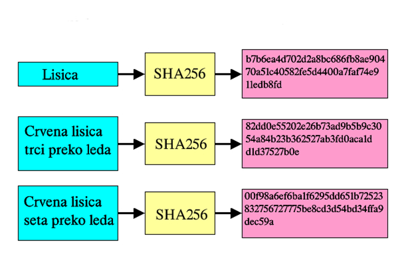
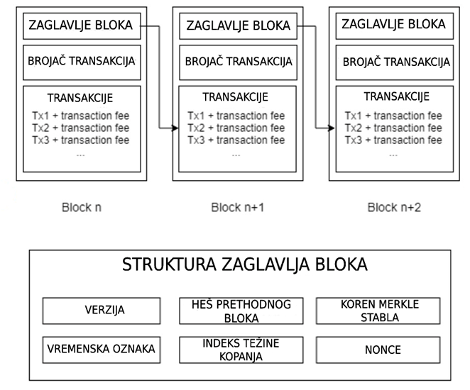

# Blockchain

## Pregled dokumenta

- [Funkcije heširanja](#funkcije-heširanja)
- [Blok](#blok)
- [Suština sistema](#blockchain-sustina)

### <a name="funkcije-hesiranja">Funkcije heširanja</a>

Heš funkcije, odnosno funkcije heširanja su matematički algoritmi koji mapiraju poruku proizvoljne veličine na niz bitova fiksirane veličine koji se naziva heš vrednost[[1]](https://citeseerx.ist.psu.edu/document?repid=rep1&type=pdf&doi=b46f9e87038b96769f47d819e204e6db1190e00b). Algoritmi su osmišljeni tako da budu jednosmerni, odnosno da se za svaku poruku veoma lako odredi heširana vrednost, prateći korake algoritma, ali je gotovo nemoguće od heširane vrednosti dobiti originalnu poruku. Štaviše, jedan od najboljih načina za određivanje početne poruke od heširane vrednosti je nagađanje. Funkcija heširanja mora biti deterministička, odnosno takva da se od identičnih početnih poruka uvek dobija identična heširana vrednost. Osim toga, dobra funkcija heširanja mora u kratkom vremenskom roku da dobija izlaz. Za dve različite početne poruke, ne bi smeo da se dogodi slučaj kada se za njihovu haširanu vrednost dobije isti niz bitova, i tada bi heš funkcija gubila smisao. Svaka mala promena u početnoj poruci ulaza bi trebala da promeni haširanu vrednost u potpunosti, tako da se novodobijena vrednost ne dovodi u slučaj sa vrednošću pre promene. Ove funkcije su veoma značajne u današnjem računarstvu, kao i kriptografiji, i osnova su bez koje blokčejn tehnologije ne bi mogle da funkcionišu. Najpoznatije heš funkcije su MD5, SHA-1, SHA-2, SHA-3.

### <a name="blok">Blok</a>

Blok je gradivna jedinica lanca blokova. Svaki blok se sastoji iz više delova i različiti sistemi mogu imatu različit format bloka. Uloga bloka je da sadrži u sebi podatke, odnosno događaje koji su se desili na mreži, kao i osigura povezanost sa svim blokovima počevši od prvog „genesis“ bloka. Kako bi se osigurala autentičnost svaki blok je digitalno potpisan[[2](https://jis-eurasipjournals.springeropen.com/articles/10.1186/s13635-019-0085-3)]. Iako deo bloka sa transakcijama može biti potpuno prazan, svaki blok sadrži zaglavlje unutar kog postoji više polja. Ono što blokove čini ulančanim je to što poslednji blok u lancu sadrži heširanu vrednost zaglavlja pretposlednjeg bloka, i taj princip se iterativno ponavlja sve do prvog iskopanog bloka u mreži. Podaci na bloku osiguravaju autentičnost primenom „Merkle tree“, strukture dobijene heširanjem para podataka, a zatim ponovnim heširanjem dobijenih heširanih vrenosti, sve dok se ne dobije koren stabla, odnosno jedna konačna heširana vrednost. Ta vrednost se zatim čuva u zaglavlju bloka. Veoma bitna polja u zaglavlju bloka su tačno vreme kada je blok iskopan, i promenljiva „Nonce“. Kopanje bloka „Proof of Work“ koncenzus algoritmom predstavlja sukcesivno pogađanje vrednosti ove promenljive sve dok heširana vrednost zaglavlja ne zadovolji određene kriterijume, odnosno dok heširana vrednost zaglavlja ne bude manja od broja postavljenog za težinu kopanja. Svaki mreža ima prosečno vreme za koje se iskopa jedan blok, tako da se promenom težine kopanja postiže konzistentnost pri prosečnom vremenu potrebnom za jedan blok. Veća računarska moć posvećena kopanju zahteva veću težinu, jer se više računarskih jedinica takmiči da nađe odgovarajuću vrednost za promenljivu „Nonce“. „Proof of Work“ je prvi koncenzus algoritam, njegovi naslednici kao što su „Proof of Stake“, „Proof of Space and Time“, itd su unapređeni tako da ne troše toliko računarske moći i električne energije na pogađanje broja, već je to odrađeno na pametnije načine. Ukoliko bi maliciozni korisnik želeo da kompromituje blok, i ubaci svoje podatke kao aktuelne, morao bi da ubedi više od polovine učesnika mreže da su njegovi podaci validni, a ukoliko bi želeo da izmeni nešto iz bloka iskopanog u prošlom vremenu, on bi morao da „iskopa“ sve naredne blokove nakon izmenjenog u istom vremenskom intervalu za koji cela mreža iskopa trenutni blok.

### <a name="blockchain-sustina">Suština sistema</a>

Osnovna suština Blockchain sistema leži u njegovoj sposobnosti da obezbedi decentralizovan, transparentan, siguran način čuvanja i verifikacije transakcija koji je otporan na neovlaščeni uticaj. Ključne komponente koje obuhvataju samu suštinu su

#### 1. Decentralizacija

- Blockchain je distribuirana mreža računara (node-ova) bez centralnog autoriteta. Decentralizacijom se eliminiše potreba za centralnu tačku kontrole i povećava se sistemska otpornost.

#### 2. Nepromenjive informacije

- Kada se informacije jednom zapišu u blockchain sistem, one se kriptografski povezuju sa prethodnim blokom, i tako dolazi do ulančavanja. Ovim ulančavanjem postiže se otežavanje menjanja upisanih informacija, odnosno osigurava se integritet podataka.

#### 3. Koncenzus mehanizam

- Blockchain sistemi koriste koncenzus mehanizam (npr Proof of Work, Proof of Stake) kako bi se obezbedila validnost transakcija i osiguralo da svi učesnici imaju konzistentno stanje informacija. Ovim algoritmom se obezbeđuje protiv nemogućeg trošenja, kao i prevara

#### 4. Transparentnost

- Istorija transakcija je u čestom slučaju dostupna svim učesnicima na mreži. Ovime se obezbeđuje transparentnost kao nivo zaštite od nevalidne potrošnje sredstava, odnosno tokena

##### 5. Kriptografska sigurnost

- Korišćenjem kriptografskih tehnika osigurava se validnost transakcija i kontrola pristupa. Javni i privatni ključevi se redovno koriste za autentifikovane interakcije unutar mreže.
